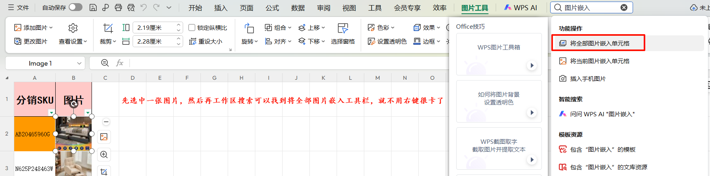
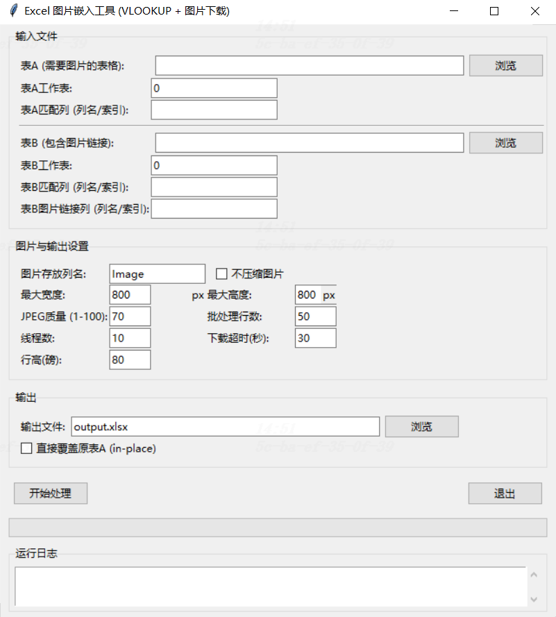

# 📊 Excel VLOOKUP + 图片嵌入工具使用指南

> **功能简介**：批量实现 Excel 表格的 VLOOKUP 匹配逻辑，根据匹配结果自动下载在线图片并嵌入到单元格中

---

## 📌 重要说明

### ⚠️ 使用前必读

1. **手动嵌入操作**：程序无法自动完成"图片嵌入单元格"操作，需手动执行（详见文末操作步骤）
2. **表格格式变更**：处理后的表格格式和设计会发生变化
3. **最佳实践**：建议输入表格仅保留待插入图片的工作表，尽量简化表格结构

### ℹ️ 其他注意事项

- 🌐 **需要联网**：程序需下载在线图片
- 🔄 **进度展示**：GUI 采用轮询机制更新进度，避免频繁刷新影响性能
- 🧹 **自动清理**：临时文件和内存会自动释放
- ⚙️ **可配置项**：轮询间隔可在脚本中调整

---

## 🎯 手动嵌入图片到单元格的操作步骤

程序处理完成后，如需将图片嵌入单元格（以便使用 VLOOKUP 传递），请按以下步骤操作：

1. 用 **WPS Office** 打开输出的 Excel 文件
2. 选中任意一张已插入的图片
3. 在顶部菜单栏搜索框中输入 "**图片嵌入**"
4. 点击搜索结果中的 "**所有图片嵌入单元格**" 选项
5. 所有图片将以 `DISPIMAGE` 函数形式嵌入到对应单元格中
6. 此时可通过 VLOOKUP 函数将图片引用传递到其他工作表

<div align="center">
  
  <br/>
  <strong>图1：批量嵌入图片到单元格操作</strong>
</div>

---

## 1️⃣ 功能概述

本工具用于批量实现 Excel 表格的 **VLOOKUP** 匹配逻辑，并根据匹配结果自动下载网络图片，将其压缩后嵌入到指定单元格中。

### ✨ 核心特性

- 🔍 **智能匹配**：根据表 A 和表 B 的指定列进行精确匹配（类似 VLOOKUP 功能）
- 📥 **自动下载**：从表 B 获取图片链接，自动下载并嵌入到表 A 的对应单元格
- 💾 **离线可用**：图片直接保存在 Excel 文件内部，无需网络连接即可查看
- 🗜️ **智能压缩**：支持自定义图片尺寸和 JPEG 质量，有效控制文件体积
- ⚡ **高效处理**：支持分批处理和多线程下载，轻松应对数万行数据，防止内存溢出
- 📂 **灵活输出**：支持覆盖原文件或另存为新文件
- 🧹 **安全清理**：过程文件自动清理，异常退出也不会残留临时文件

## 2️⃣ 适用场景

- 🛍️ **电商管理**：批量插入产品图片、商品缩略图到库存清单
- 👥 **人事管理**：为员工档案表批量添加员工头像
- 📜 **证书管理**：将证书扫描件批量嵌入到认证记录表
- 📊 **数据整合**：有两个表格时，表 A 缺少图片，表 B 包含图片链接及匹配字段，需要将图片按匹配字段"搬运"到表 A
- 📶 **离线需求**：要求图片能在无网络环境下显示，且最终 Excel 文件体积可控

## 3️⃣ 环境要求

### 系统要求

- Python 3.8 及以上版本（推荐 3.10+）
- Windows / macOS / Linux 操作系统

### 依赖库

安装命令：
```bash
pip install pandas openpyxl xlsxwriter Pillow requests
```

| 库名 | 用途 | 说明 |
|------|------|------|
| `pandas` | 数据处理 | 读取和操作 Excel 数据 |
| `openpyxl` | Excel 读写 | 支持 `.xlsx` 格式 |
| `xlsxwriter` | Excel 写入 | 支持图片嵌入功能 |
| `Pillow` | 图片处理 | 图片下载、压缩、格式转换 |
| `requests` | 网络请求 | 下载在线图片 |
| `tkinter` | 图形界面 | Python 标准库，通常已预装 |

## 4️⃣ 快速开始（GUI 操作）

### 🚀 启动程序

在命令行中运行：
```bash
python URLtoImageBydsV3-GUI.py
```

### 📋 配置步骤

#### 第一步：选择表 A（主表格）

1. 点击"表A"右侧的"**浏览**"按钮
2. 选择需要插入图片的主表格文件（支持 `.xlsx` 和 `.xls` 格式）

#### 第二步：配置表 A 的工作表和匹配列

- **工作表**：输入工作表名称（如 `Sheet1`）或索引号（`0` 表示第一个工作表）
- **匹配列**：输入用于匹配的列名（如 `产品编号`）或列索引（`0` 表示第一列）

#### 第三步：选择表 B（数据源表格）

1. 点击"表B"右侧的"**浏览**"按钮
2. 选择包含图片链接的数据源表格

#### 第四步：配置表 B 的参数

- **工作表**：设置方式同表 A
- **匹配列**：与表 A 进行匹配的列名或索引
- **图片链接列**：表 B 中存储图片 URL 的列名或索引

#### 第五步：图片设置（可选）

- **图片存放列名**：默认为 `Image`。若该列已存在则覆盖内容，否则在表格末尾新增一列
- **图片压缩设置**：取消勾选"不压缩图片"后可配置：
  - **最大宽度/高度**：图片等比缩放的最大尺寸
  - **JPEG 质量**：压缩质量参数（1-100）
- **高级参数**：批处理行数、下载线程数、超时时间、行高等（保持默认值即可满足大多数需求）

#### 第六步：输出设置

- **另存为新文件**：填写输出文件的保存路径（点击"浏览"按钮选择位置）
- **直接覆盖原表 A**：⚠️ 勾选后将直接修改表 A 文件（操作前请关闭表 A，建议先备份）

#### 第七步：开始处理

1. 点击"**开始处理**"按钮
2. 观察日志窗口和进度条了解处理状态
3. 等待处理完成的提示信息

<div align="center">
  
  <br/>
  <strong>图2：工具GUI界面</strong>
</div>

## 5️⃣ 参数详解

| 参数名称 | 说明 | 示例值 |
|---------|------|--------|
| 表A文件 | 需要插入图片的主表格文件路径 | `C:\data\产品清单.xlsx` |
| 表A工作表 | 工作表名称或索引号（从 0 开始） | `Sheet1` 或 `0` |
| 表A匹配列 | 用于匹配的列名或列索引 | `产品编号` 或 `0`（第一列） |
| 表B文件 | 包含图片链接的数据源表格路径 | `C:\data\图片库.xlsx` |
| 表B工作表 | 工作表名称或索引号 | `图库` 或 `0` |
| 表B匹配列 | 与表 A 进行匹配的列名或索引 | `编号` 或 `2` |
| 表B图片链接列 | 存放图片 URL 的列名或索引 | `图片URL` 或 `3` |
| 图片存放列名 | 图片将嵌入到表 A 的列名 | `缩略图`（若存在则覆盖，否则新增） |
| 不压缩图片 | 勾选后使用原始图片（可能导致文件体积过大） | 默认不勾选 |
| 最大宽度/高度 | 图片等比缩放的最大像素尺寸 | `800×800` |
| JPEG质量 | 压缩质量（1-100），数值越小文件越小但画质越低 | `70` |
| 批处理行数 | 每批次处理的行数（减小可降低内存占用） | `50` |
| 线程数 | 同时下载图片的线程数（建议不超过 20） | `10` |
| 下载超时 | 单张图片下载的最长等待时间（秒） | `30` |
| 行高 | 图片所在行的行高（磅值） | `80` |
| 输出文件 | 另存为新文件的路径（与"覆盖原表"二选一） | `C:\output\结果.xlsx` |
| 直接覆盖原表A | 勾选后直接修改表 A（忽略输出文件路径） | ⚠️ 谨慎使用 |

## 6️⃣ 技术原理与高级说明

### 6.1 🖼️ 图片压缩机制

- **格式统一**：所有下载的图片统一转换为 **JPEG 格式**（若原图包含透明通道，将转换为白色背景）
- **等比缩放**：使用 Pillow 库的 `thumbnail()` 方法，按照设定的最大宽度和高度进行等比例缩放
- **质量控制**：通过 JPEG 质量参数控制压缩率，推荐设置为 **70~85**，可在清晰度和文件体积之间取得良好平衡

### 6.2 ⚡ 分批处理与内存优化

- **分批读取**：程序逐批读取表 A 的行数据，每批处理"批处理行数"指定的记录数
- **内存管理**：仅在内存中保留当前批次的图片数据，处理完即释放
- **恒定内存模式**：配合 xlsxwriter 的恒定内存模式，即使处理数十万行数据也不会导致内存耗尽

### 6.3 🧹 自动清理机制

- **临时文件管理**：程序运行期间仅在系统临时目录创建中间文件
- **自动迁移**：处理成功后自动将临时文件移动到目标位置，并删除临时文件
- **异常处理**：若程序异常中断或被强制关闭，`atexit` 模块和信号处理器会自动触发清理流程，确保不留垃圾文件

### 6.4 ⚠️ 覆盖原文件的安全保障

- **原子操作**：勾选"直接覆盖原表A"时，程序先将结果写入临时文件，全部处理成功后才替换原文件
- **数据安全**：即使处理过程中出现错误，原文件也不会损坏
- **备份建议**：尽管有安全保障，仍建议在处理重要数据前先进行备份

## 7️⃣ 常见问题 (FAQ)

### ❓ Q1：图片显示 "#VALUE!" 或无法加载？

**答**：请检查表 B 中的图片链接是否有效（可在浏览器中打开测试）。如果链接需要登录认证或有防盗链保护，程序将无法下载图片。

### ❓ Q2：生成的 Excel 文件体积过大，如何缩小？

**答**：可采用以下方法：
- 启用图片压缩功能，适当降低 JPEG 质量（如设置为 50~60）
- 减小图片的最大宽度和高度（如设置为 300×300）
- 上述调整对文件大小有显著影响

### ❓ Q3：可以只更新部分行的图片，而不是处理整个表格吗？

**答**：当前版本会从表 A 的第 2 行开始处理所有行。如果只需要更新部分数据，建议先筛选出需要的行，另存为新表格后再进行处理。

### ❓ Q4：支持 Excel 的 IMAGE() 函数吗？

**答**：不支持。IMAGE() 函数需要依赖网络链接才能显示图片，无法实现离线查看。本工具将图片直接嵌入到文件内部，确保在无网络环境下也能正常显示。

### ❓ Q5：程序运行缓慢或长时间无响应怎么办？

**答**：如果网络状况较差或图片数量较多，可以尝试：
- 减少下载线程数（如设置为 5）
- 增加下载超时时间（如设置为 60 秒）
- 查看日志窗口中的失败记录，了解具体原因

### ❓ Q6：支持哪些图片格式？

**答**：程序支持常见的图片格式，包括 JPG、PNG、GIF、WebP 等。所有图片在下载后会统一转换为 JPEG 格式以减小文件体积。

### ❓ Q7：如何处理大量数据（如超过 10 万行）？

**答**：程序已针对大数据量进行优化：
- 适当增加批处理行数（如 100~200）可提高处理速度
- 保持线程数在合理范围（10~15），避免过多并发导致网络阻塞
- 启用图片压缩可有效控制最终文件体积

---

## 📞 反馈与支持

> 💡 **温馨提示**：本工具旨在提升 Excel 表格批量处理效率。如有任何建议、问题或发现 Bug，欢迎反馈！

---

**祝使用愉快！** 🎉
